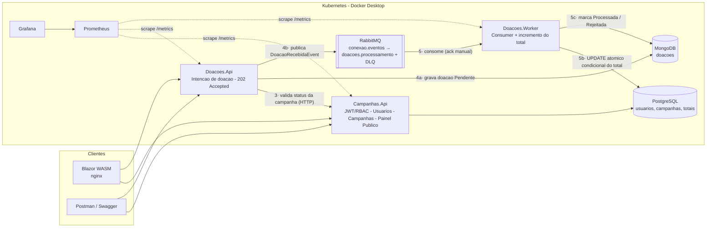

# Arquitetura — Conexão Solidária

## Visão geral

A plataforma é composta por **3 microsserviços .NET 9**, **2 bancos de dados**
(persistência poliglota), **RabbitMQ** para comunicação assíncrona e o stack
**Prometheus + Grafana** para observabilidade — tudo orquestrado em
**Kubernetes**.

## Fluxo da doação (ponta a ponta)

1. O doador autentica no **Campanhas.Api** e recebe um **JWT** com a role `Doador`.
2. `POST /api/doacoes` no **Doacoes.Api** (o mesmo JWT é validado localmente —
   chave HS256 compartilhada via configuração).
3. O Doacoes.Api **valida a campanha** via HTTP (`GET /api/publico/campanhas/{id}`)
   com retry/circuit breaker (`AddStandardResilienceHandler`). Campanha
   `Concluida`/`Cancelada` → **422**; inexistente → **404**.
4. Persiste a doação como **Pendente** no MongoDB e **publica
   `DoacaoRecebidaEvent`** no RabbitMQ. Responde **202 Accepted** —
   *a API nunca atualiza o total arrecadado* (requisito do edital).
5. O **Doacoes.Worker** consome a fila (`ack` manual, prefetch 5) e, numa única
   transação no Postgres:
   - `INSERT ... ON CONFLICT DO NOTHING` na tabela `doacoes_processadas`
     (**idempotência**: redelivery jamais soma duas vezes);
   - `UPDATE campanhas SET ValorTotalArrecadado += valor WHERE Status = 'Ativa'`
     (**atômico e condicional**: sem read-modify-write e revalida a regra — a
     campanha pode ter sido cancelada entre o aceite e o processamento).
   - Atualiza o status da doação no Mongo (`Processada`/`Rejeitada`) e
     incrementa o counter `conexao_doacoes_processadas_total`.
6. Falhas: retry in-process (3x, backoff 1s/3s/9s) → esgotou → `BasicNack`
   sem requeue → a mensagem cai na **DLQ** (`doacoes.processamento.dlq`),
   preservada para inspeção na Management UI.
7. O Painel de Transparência (`GET /api/publico/campanhas`) passa a exibir o
   total atualizado.

## Decisões e trade-offs

| Decisão | Justificativa |
|---|---|
| **RabbitMQ** (vs Kafka) | Leve no cluster local, cliente .NET maduro e Management UI pronta — exigida no roteiro do vídeo. Kafka faria sentido para streaming de alto volume/replay. |
| **`RabbitMQ.Client` puro atrás de `IEventBus`** (vs MassTransit) | A topologia (exchange, fila, DLX, DLQ) fica explícita e visível na UI com os nomes que declaramos — didático e demonstrável. Trocar o broker = nova implementação de `IEventBus` (DIP/OCP). |
| **202 Accepted na doação** | Materializa o assincronismo no contrato HTTP: o cliente recebe o `doacaoId` e acompanha o status em `/api/doacoes/minhas`. |
| **Worker escreve direto no Postgres** (vs endpoint interno no Campanhas.Api) | Idempotência + incremento na **mesma transação**; um único salto de falha (fila→worker→banco). O `WorkerDbContext` mapeia só 3 colunas (ISP aplicado a dados). **Trade-off reconhecido**: fere o "database per service" purista — em produção, o incremento seria um consumer do próprio contexto de Campanhas ou um endpoint interno autenticado. |
| **Sem outbox pattern** | Existe a janela "gravou no Mongo mas caiu antes de publicar". Para o MVP aceitamos o risco (doação ficaria `Pendente` para reconciliação); a evolução natural é o **Transactional Outbox**. |
| **PostgreSQL + MongoDB** | Persistência poliglota — justificativa completa em [BANCOS.md](BANCOS.md). |
| **JWT HS256 com chave compartilhada** | Simples e suficiente para 2 validadores no mesmo cluster. Evolução: RS256 com chave pública distribuída ou um Identity Provider (Keycloak/Entra). |
| **Infra como Deployment + PVC (`Recreate`)** (vs StatefulSet) | O edital pede literalmente "Deployments, Services, ConfigMaps"; num cluster local de 1 nó, StatefulSet só acrescentaria conceitos. Em produção: operadores gerenciados (CloudNativePG, MongoDB Operator) ou serviços de nuvem. |
| **NodePort fixo** (vs Ingress) | Docker Desktop expõe NodePort direto em `localhost` — professores abrem as URLs sem port-forward nem ingress controller. |
| **Swagger ligado em Production** | O MVP é corrigido via Swagger; num produto real ficaria atrás de auth ou desligado. |

## Observabilidade: por que Prometheus (e não Zabbix)?

O critério de aceite exige: métricas expostas (`/health` ou `/metrics`) e
**dashboard Grafana com métricas reais** (CPU/memória dos pods ou contagem de
requisições HTTP). Adotamos **Prometheus** como coletor por ser o padrão de
fato do ecossistema Kubernetes: CPU/memória de pods vêm nativamente do
kubelet/cAdvisor (que o Prometheus raspa via kube-prometheus-stack), e os três
serviços expõem `/metrics` no formato Prometheus (`prometheus-net`), incluindo
a métrica de negócio `conexao_doacoes_processadas_total`. O **Grafana** exigido
consome esse Prometheus. O Zabbix, orientado a hosts/agentes, é adequado para
monitorar VMs e infraestrutura tradicional — cenário que não se aplica ao
cluster local; colocá-lo aqui exigiria esforço alto sem atender melhor nenhum
critério.

Cada serviço expõe ainda três endpoints de saúde:
`/health` (agregado), `/health/ready` (dependências — readiness probe) e
`/health/live` (self — liveness probe).

## Segurança (resumo)

- Senhas com **BCrypt**; erro de login genérico (não revela e-mails).
- RBAC por role no JWT: `[Authorize(Roles = "GestorONG")]` nos endpoints de
  gestão; `Doador` nos de doação.
- CPF validado (dígitos verificadores), nunca exposto em endpoints públicos e
  **mascarado** no `/api/auth/me`. Detalhes em [LGPD.md](LGPD.md).
- Secrets fora do código (env vars / Secrets do K8s). Os valores dev são
  versionados **de propósito** para correção acadêmica, com aviso no arquivo.
